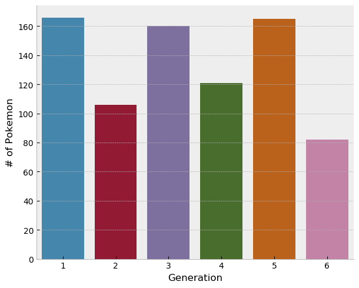
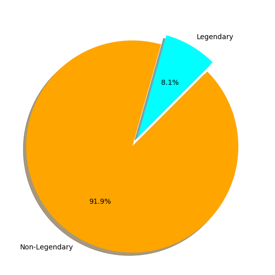
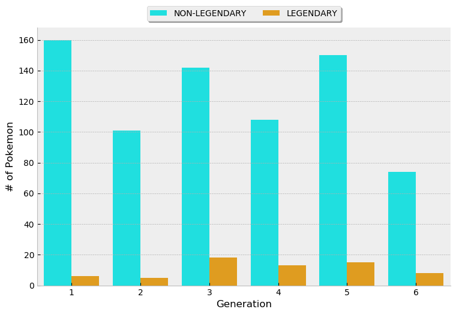
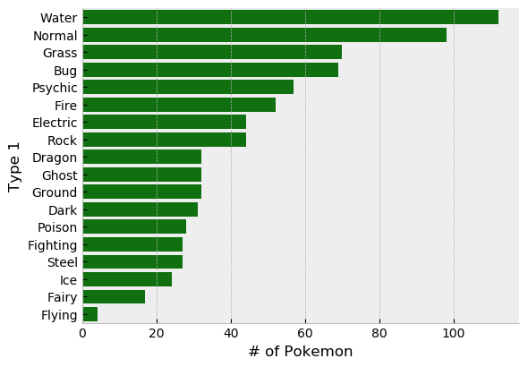
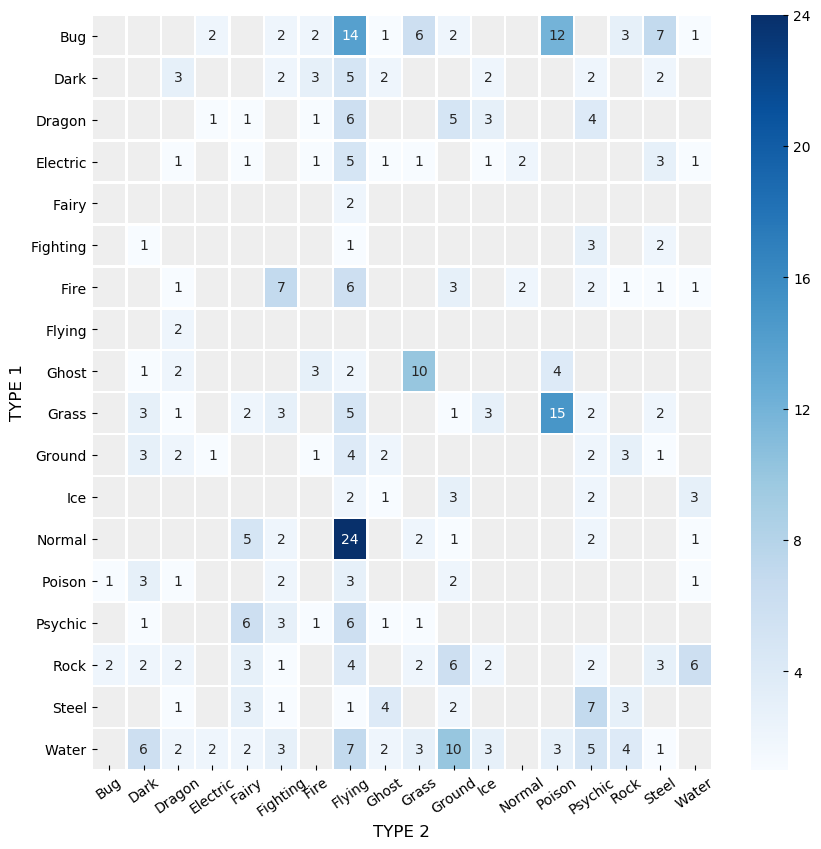
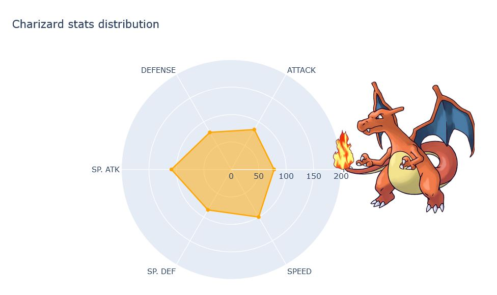

# Exploratory-Data-Analysis-On-Pokemon-Dataset
## Subtitle describing the analysis 

**Author**: SHAILESH DHAMA

### Dataset:

The Pokemon dataset is a listing of all Pokemon species as of mid-2016, containing data about their type and statistics. Considering how diverse Pokemon are, I was interested in analyzing this datset to learn how the game is balanced and to potentially identify the best Pokemon, if there exists one.

### LIBRARIES:
    1.Numpy
    2.Pandas
    3.Matplotlib
    4.Seaborn
    5.Plotly

## RESULTS :

#### Visualisations:

> Generations of Pokemons


> Pie-Chart about Legendary and Non-legendary Pokemons


> Generations of Legendary and Non-legendary Pokemons

#### Types Of Pokemons:

> Pie_chart on Types of Pokemons


> Bar_Graph on Types of Pokemons


> Correlation_Matrix on Types of Pokemons

#### Plotly Stats Distribution:

> Ninjask Stats Distribution


> Charizard Stats Distribution


> Blastoise V/S Charizard Stats Distribution

### For further information
Please review the narrative of our analysis in [our jupyter notebook](./analysis-on-pokemon-dataset.ipynb)

For any additional questions, please contact **shaileshshettyd@gmail.com)


##### Repository Structure:
```

├── README.md                                       <- The top-level README for reviewers of this project.
├── analysis-on-pokemon-dataset.ipynb               <- narrative documentation of analysis in jupyter notebook
└── images                                          <- both sourced externally and generated from code
```
